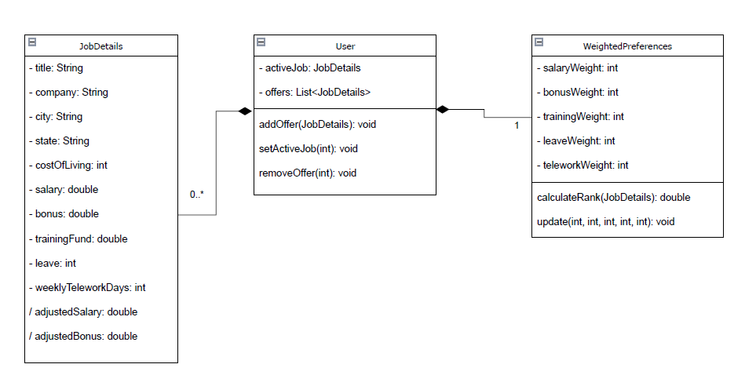
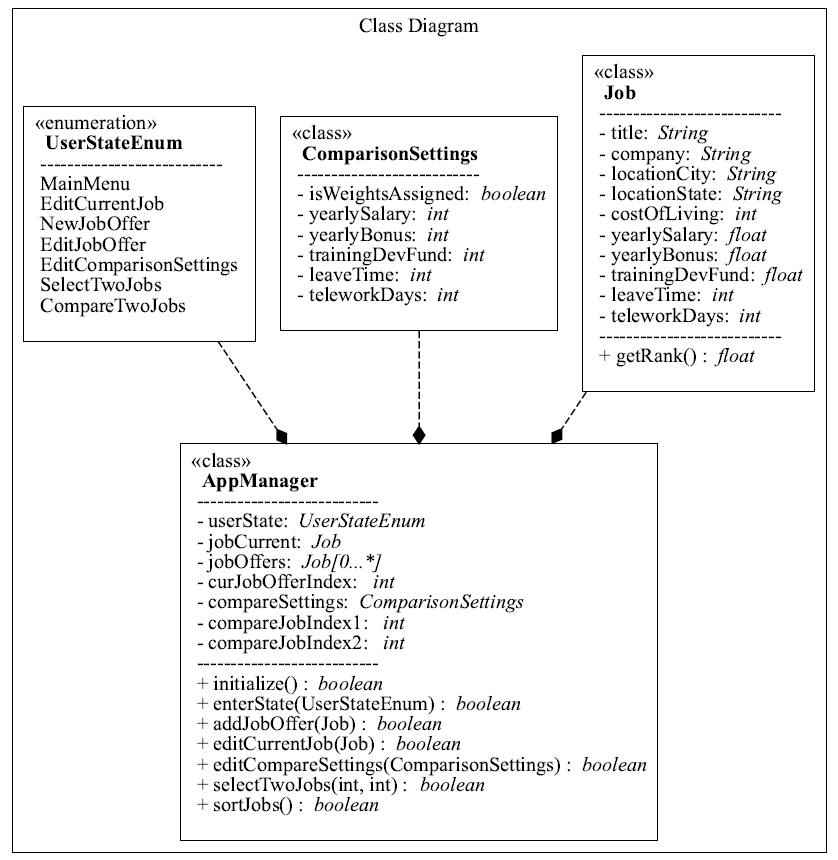
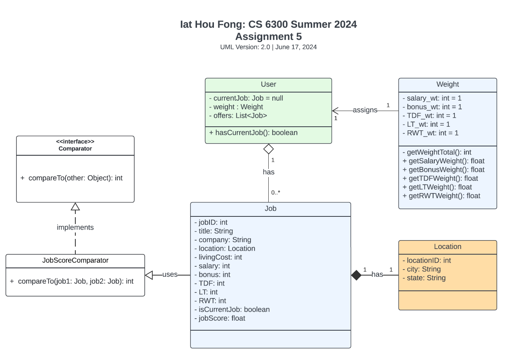
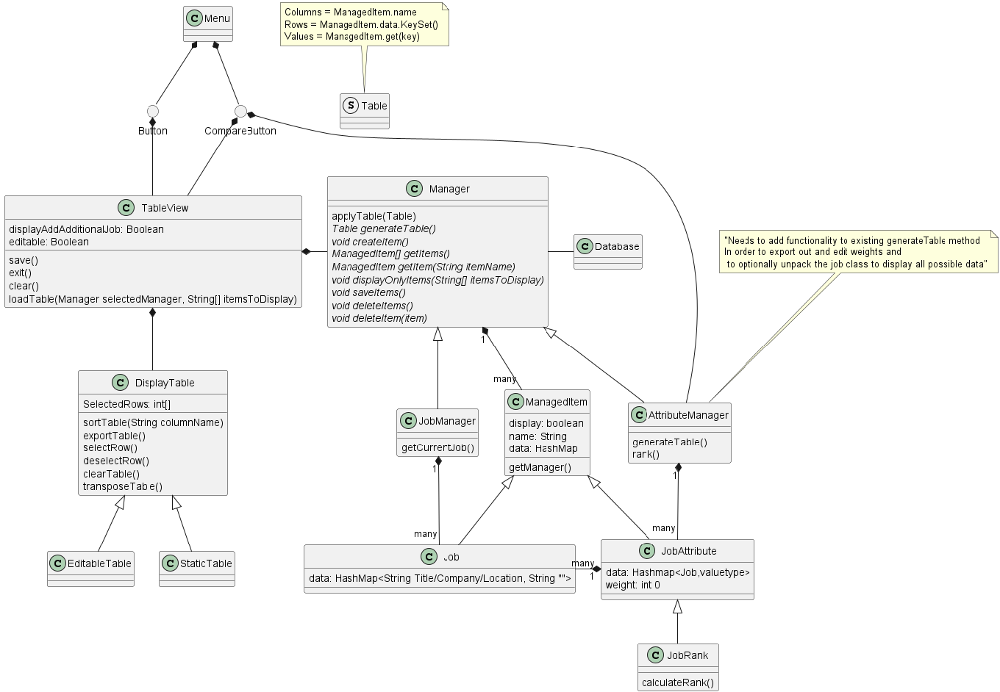
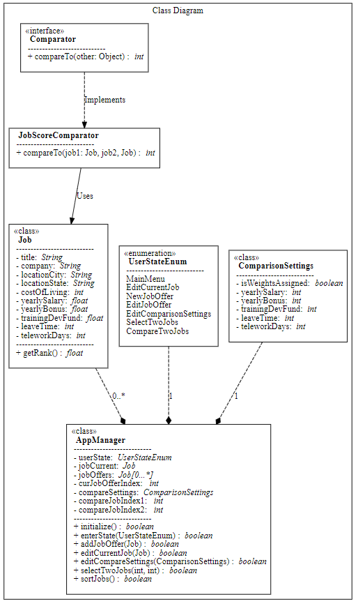

# Design Discussion

We met for a team discussion to contrast and compare our individual designs, with a goal of selecting a single design for the team.  In our discussion, we noted that all of the designs had very similar structural graph elements, so our group design should be a hybrid design.  

## Design 1: Chris (cmenzel6)

Coming from an Android development background, Chris specified his design with the intent of keeping the UML simple.  The bulk of the requirement implementation will fall under Android activity structures.  Overall, his design specifies a main User class, which uses JobDetails and WeightedPreferences classes as associations.

The strong point of this design is its simplicity, and allowing for more of the design decisions to end up in the implementation.

## Design 2: Erik (ebakke3)

Erik's design centers around an ActivityManager class, which is the entry point of the app.  This class implements the bulk of the logic in the app.  It has an associated enumerated type UserStateEnum, which defines the current state in a finite state machine (FSM).  The design uses associated classes Job and ComparisonSettings to define the required data parameters and functions that satisfy the app requirements.

We found that points of this design are its relative simplicity, combined with a finite state machine structure to decouple the UI and user state in the final implementation.

## Design 3: Kevin (ifong6)

Kevin's design has a similar pattern as the others, with a User entry point class representing the center of implementation.  It has associated classes Weight and Job.  One strong point of this design is the inclusion of a JobScoreComparator which implemnents a Comparator interface.  This allows for using built-in Java sorting functions of that class, which will simplify code readability in the implemenation.

## Design 2: Nick (ncoury6)

Nick's design uses a Manager primary class, which is the entry point and center of app behavior.  Nick made a generalize approach of associated Attribute and AttributeManager classes to allow for future changes in the app's data types if there are any requirement changes during the development cycle.  He also included generalized TableView and DisplayTable classes for displaying the data outlined in the requirements.

Strong points of this design are in its flexibility with regards to change during the development cycle.  If requirements change and new data types are added, it is easy to simply create new inherited data type classes and use them in the AttributeManager.

## Team Design

Our chosen design is based on the structure that is repeated across all of our individual designs.  It uses a central Manager class as entry point, and associated Job and ComparisonSettings classes.  We chose Erik's design as a base structure.  It includes a finite state machine with associated enumerate type UserState.  This allows decoupling of the UI and user state in the final implementation.

We added a JobScoreComparator dependency which implemnents a Comparator interface.  This allows for using built-in Java sorting functions of that class, which will simplify code readability in the implemenation.  This will be used for sorting our Job list in the implementation.

## Summary

Overall, each team member's chosen design strategy ended up being very similar.  Given the requirements and scope of this app design, it makes sense that we each came up with a very similar design.  In our discussion, we opted to choose a team design which focuses on a minimal set of features which meets the requirements, allowing for more breadth of implemention decision making once we begin coding the actual app.  

Much of the implementation will be encoded in the Android activity.  We attempted to include enough specificity in the design as to satisfy the requirments, but not so much as to limit our choices during the project implementation phase.