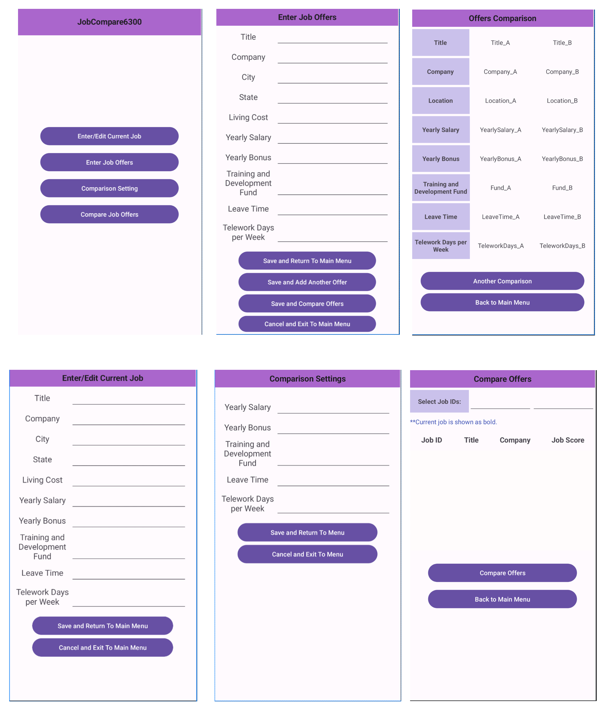

# Design Document

**Author**: Team 134

## 1 Design Considerations

### 1.1 Assumptions

* The provided job factors are the only ones to consider.  Users cannot dynamically add new factors to consider.
* Provided factors are limited to the provided ranges, namely:
  * Training fund $0-$18000, inclusive, rounded to nearest cent
  * Leave time 0-100 days, inclusive, in whole numbers
  * Remote teleworking days per week 0-7, inclusive, in whole numbers
* Preference weights range from 0-9, inclusive, in whole numbers
* Users will only input a single currency (assumed to be USD), and will not require an exchange conversion

### 1.2 Constraints

* Cross-device communication or sharing is not supported
* Networked storage is not supported, only locally backed storage

### 1.3 System Environment

 * Android device running Android OS version 13 (Tiramisu) with SDK Level 33, or later

## 2 Architectural Design

### 2.1 Component Diagram

* A component diagram is unnecessary for this project as the application is only required to run a single system, with no cross-device or network storage support.

### 2.2 Deployment Diagram

* A deployment diagram is unnecessary for this project as deployment will be handled by the Google Play Store, allowing users to install the applicaiton to their Android devices individually.

## 3 Low-Level Design

### 3.1 Class Diagram

## 4 User Interface Design

