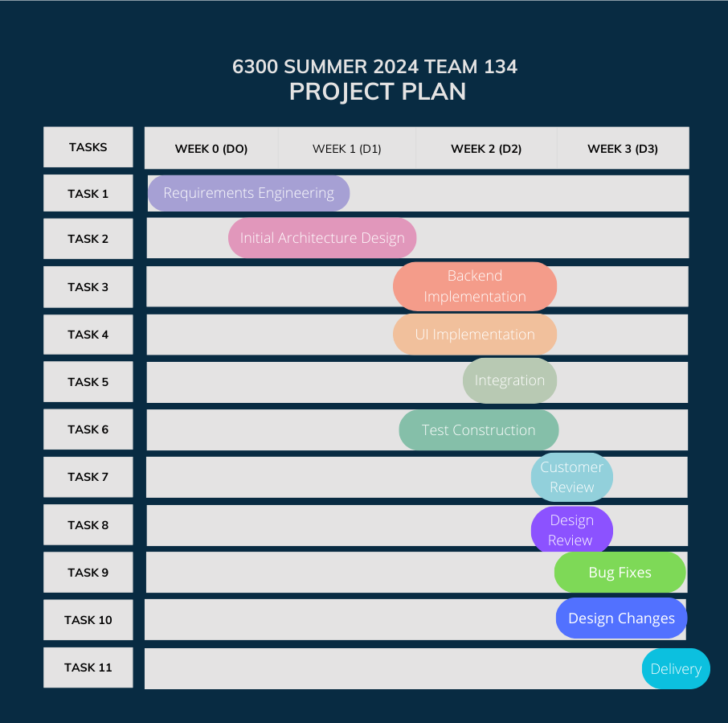
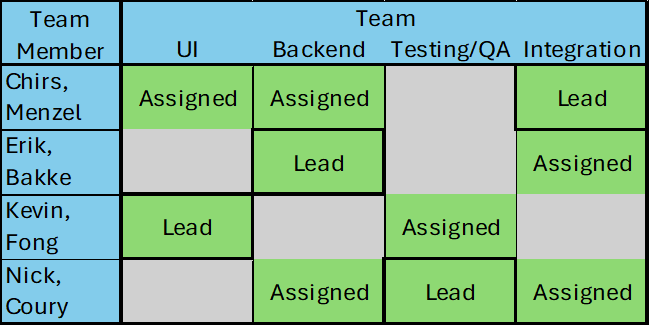

# Project Plan

**Author**: Nicholas Coury

## 1 Introduction

George P. Burdell has commissioned us with the creation of an app to assist in the comparison of different job offers, looking at
a variety of aspects. The project length is three weeks from inception to final delivery. The app will be implemented for the 
Android OS only and be capable of allowing a single user to enter job offer information and make simple comparisons between offers. 

## 2 Process Description

The project process will be implemented based on Rational Unified Process (RUP) due to the simplicity of the app,
the short timeline, and the need for a highly parallel workflow to distribute  work.
<figure>
    
	<figcaption>Project Schedule</figcaption>
</figure>

### 2.1 Inception/Requirements Engineering
Initial interview with customer and definition of requirements. Customer needs and requests are looked at
and turned into requirements that can be used for design and verification of the application.
Entrance criteria: Customer Meeting
Exit criteria: Customer Signed off on generated list of requirements

### 2.2 Initial Architecture Design
Design high level app architecture utilizing customer requirements and schedule. 
Review with team members that if architecture/design is implemented as planned 
then all requirements will be met. 
Entrance criteria: Requirements Defined
Exit criteria: Team Meeting/Approval of design goals

### 2.3 Backend Implementation
Implementation of backend architecture. Includes database implementation, job class implementation,
comparison algorithm, ect...
Entrance criteria: Initial Architecture Design
Exit criteria: Design Review

### 2.4 UI Implementation
Implementation of UI design and architecture. Includes any necessary android activities with their
respective interactable elements. 
Entrance criteria: Initial Architecture Design
Exit criteria: Design Review

### 2.5 Test Construction
Implementation/Design of tests used to verify app will meet requirements. Includes any unit tests verifying individual
components of backend and UI are bug free along with system wide tests to ensure it is functioning in its intended manner
and meets all of the design requirements. 
respective interactable elements. 
Entrance criteria: Initial Architecture Design
Exit criteria: Design Review

### 2.6 Integration
Reviews UI and backend. Ensuring UI functions and backend functions follow architecture plan and that data if flowing in the expected form.
Update system architecture as needed if design changes.
Entrance criteria: UI and Backend implementation have commenced but don't need to be finished. 
Exit criteria: Design Review

### 2.7 Customer Review (Deliverable 3 release)
Review initial version of app with customer for their input.
Solicit positive and negative reactions to how requirements were met.
Share plans for the future of app.
Entrance criteria: Alpha version of app complete
Exit criteria: Design Review

### 2.8 Design Review
Take customer feedback and review lessons learned during implementation phase to discuss any needed changes.
Review tests and assign any remaining bugs found to be fixed in the next phase of project. 
Re-engage customer with phase two plan for approval. 
Entrance criteria: Alpha version of app complete, customer meeting/review commenced 
Exit criteria: Agreed upon changes/ fixes that need to occur and direction in which to head for next phase. 

### 2.9 Bug Fixes
Take test plan and tests from phase one to discover any remaining potential bugs.
Assign them to be fixed. Only to be ended once the final version of app is delivered. 
Entrance criteria: Test Construction
Exit criteria: Delivery

### 2.10 Design Changes
Adjust design at any level based on customer feedback and test/QA results.
This includes any needed changes to the high-level architecture if there is
anything that is deemed a failure.  
Entrance criteria: Design Review
Exit criteria: Delivery

### 2.11 Final Delivery
All changes and bug fixes are final. Documentation is updated to reflect the current state of the application.
Test reports are provided to demonstrate requirements verification. 
Entrance criteria: One day before due date (Bug fixing, and design changes cease)
Exit criteria: None/ Final Activity

## 3 Team

Christopher, Menzel (Chris Menzel)
Bakke, Erik         (Erik Bakke)
Fong, Iat Hou       (Kevin Fong)
Coury, Nicholas     (Nick Coury)

### 3.1 Possible Roles
Lead: Product owner for that role/design implementation.
Assigned: Team member expected to assist Lead in implementation of that design element.

UI: Implementation of UI elements in Android OS and any necessary functions for handling user interaction
Backend: Implementation of data elements/algorithms that provides/stores data for UI functions
Testing/QA: Resposbile for constructing tests that can be used to verify integrity of application and that it meets requirements. 
Integration: Resposbile for ensuring backend and UI communicate flawlessly and for making overall architecture changes as issues and design changes occur.

<figure>
    
	<figcaption>Team Member roles</figcaption>
</figure>
Project Manager: Nick Coury
