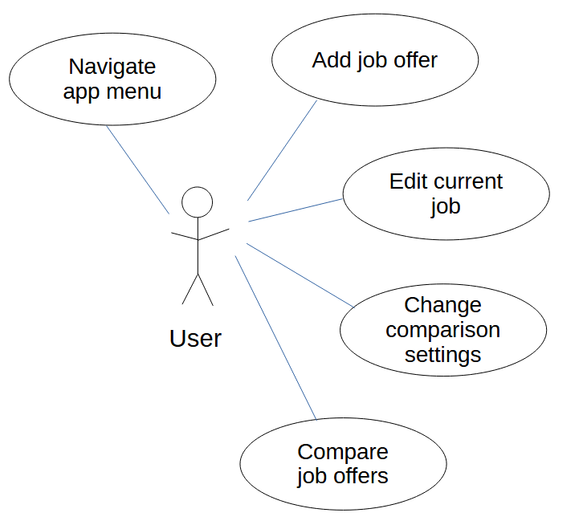

# Use Case Model

*This is the template for your use case model. The parts in italics are concise explanations of what should go in the corresponding sections and should not appear in the final document.*

**Author**: Team134

## 1 Use Case Diagram

## 2 Use Case Descriptions

### Use Case 1: Navigate app menu

**Requirements:** *When the app is started, the user is presented with the main menu, which allows the user to (1) enter or edit current job details, (2) enter job offers, (3) adjust the comparison settings, or (4) compare job offers (disabled if no job offers were entered yet).*

**Pre-conditions:** 

- AppManager is initialized by AppManager.initialize()
- AppManager.userState == MainMenu

**Post-conditions:**

- AppManager displays GUI showing opitions for (1) enter or edit current job details, (2) enter job offers, (3) adjust the comparison settings, or (4) compare job offers

**Scenarios:**

- Normal: The user starts the app, and the main menu is displayed.
- Return from sub-menu:  The user completes or exits from a separate GUI screen.  The main menu is again displayed.

### Use Case 2: Add job offer

**Requirements:**  *When choosing to enter job offers, a user will: be shown a user interface to enter all the details of the offer, which are the same ones listed above for the current job.*

*Be able to either save the job offer details or cancel.*

*Be able to (1) enter another offer, (2) return to the main menu, or (3) compare the offer (if they saved it) with the current job details (if present).*

**Pre-conditions:**

- AppManager.userState == NewJobOffer

**Post-conditions:**

- new Job is added to AppManager.JobOffers based on the user's entered job offer data

**Scenarios:**

- Normal scenario:  From Main Menu, the user selects "enter job offers" GUI button.  A GUI screen opens showing a dialog to add a new job offer.  The user enters the job offer details, and saves or cancel.  Upon cancel, return to the main menu.  Upon save, the user can select either (1) enter another offer, (2) return to the main menu, or (3) compare the offer.  If the user enters (1), the GUI dialog is reset and the user may enter another job offer.  If the user enters (2) display the main menu GUI.  If the user enters (3) show the compare offers GUI screen.

### Use Case 3: Edit current job

**Requirements:** *When choosing to enter current job details, a user will:*

*Be shown a user interface to enter (if it is the first time) or edit all the details of their current job, which consists of:*

*Title, Company, Location (entered as city and state), Cost of living in the location (expressed as an index), Yearly salary, Yearly bonus, Training and Development Fund, Leave Time, Telework Days per Week.*

*Be able to either save the job details or cancel and exit without saving, returning in both cases to the main menu.*

**Pre-conditions:**

- AppManager.userState == NewJobOffer

**Post-conditions:**

- AppManager.currentJob is updated based on the user's entered job data in the GUI

**Scenarios:**

- Normal scenario:  From Main Menu, the user selects "edit current job" GUI button.  A GUI screen opens showing a dialog to edit the current job, populated with the current job details.  The user edits the job details, and saves or cancel.  Upon cancel, return to the main menu.  Upon save, update AppManager.currentJob with the entered data, and return to the main menu GUI.

### Use Case 4: Change comparison settings

**Requirements:** *When adjusting the comparison settings, the user can assign integer weights to: Yearly salary, Yearly bonus, Training and Development Fund, Leave Time, Telework Days per Week.*

*If no weights are assigned, all factors are considered equal.*

**Pre-conditions:**

- AppManager.userState == EditComparisonSettings

**Post-conditions:**

AppManager.compareSettings is updated based on the user's entered settings data in the GUI

**Scenarios:**

- Normal scenario:  From Main Menu, the user selects "change comparison settings" GUI button.  A GUI screen opens showing a dialog to edit the current comparison settings, populated with AppManager.compareSettings data.  If AppManager.compareSettings has not been initialized, initialize all values to "1".  The user edits the comparison settings, and saves or cancel.  Upon cancel, return to the main menu.  Upon save, update AppManager.compareSettings with the entered data, and return to the main menu GUI.

### Use Case 5: Compare job offers

**Requirements:** *When choosing to compare job offers, a user will:*

*Be shown a list of job offers, displayed as Title and Company, ranked from best to worst (see below for details), and including the current job (if present), clearly indicated.*

*Select two jobs to compare and trigger the comparison.*

*Be shown a table comparing the two jobs, displaying, for each job:*

*Title, Company, Location, Yearly salary adjusted for cost of living, Yearly bonus adjusted for cost of living, TDF, LT, RWT.*

*Be offered to perform another comparison or go back to the main menu.*
*When ranking jobs, a job's score is computed as the weighted average of:*
*AYS + AYB + TDF + (LT * AYS / 260) - ((260 - 52 * RWT) * (AYS / 260) / 8))*

**Pre-conditions:**

- AppManager.userState == SelectTwoJobs, or AppManager.userState == CompareTwoJobs

**Post-conditions:**

- AppManager.compareJobIndex1 is updated based on data entry in the GUI
- AppManager.compareJobIndex2 is updated based on data entry in the GUI
- A sorted list of job offers is displayed

**Scenarios:**

- Normal scenario:  From Main Menu, the user selects "compare job offers" GUI button.  A GUI screen opens showing a dialog to select two job offers.  The GUI shows a list populated with AppManager.jobOffers list, and also includes AppManager.jobCurrent in the list.  The list is sorted by AppManager.sortJobs() method.  If AppManager.compareJobIndex1 or AppManager.compareJobIndex2 are valid, pre-select thosed job offers in the GUI.  The user may change selections of up to two jobs by clicking on any of two job offers in the GUI list.  Then the GUI shows a table comparing the two selected job offers.  Two buttons give the option for the uer to either perform another comparison or return to the main menu. 
